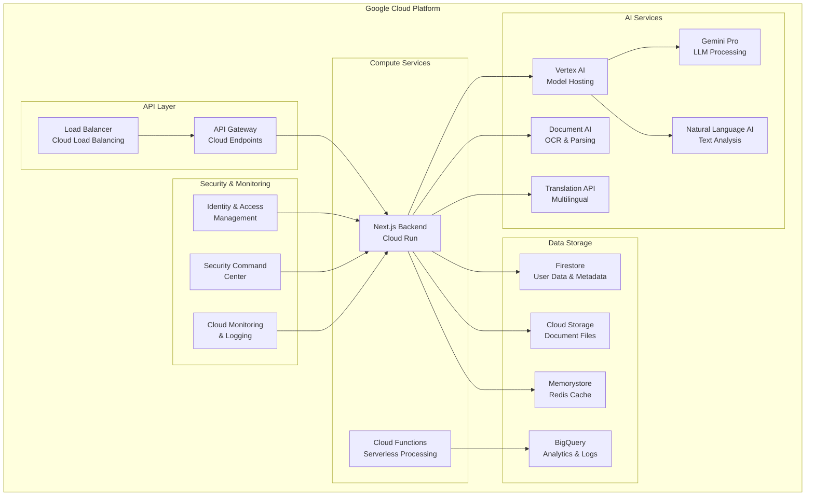
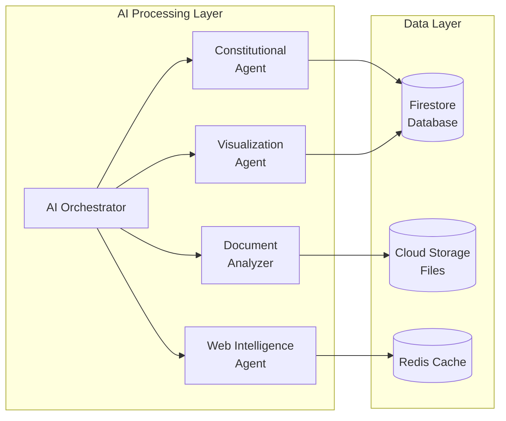
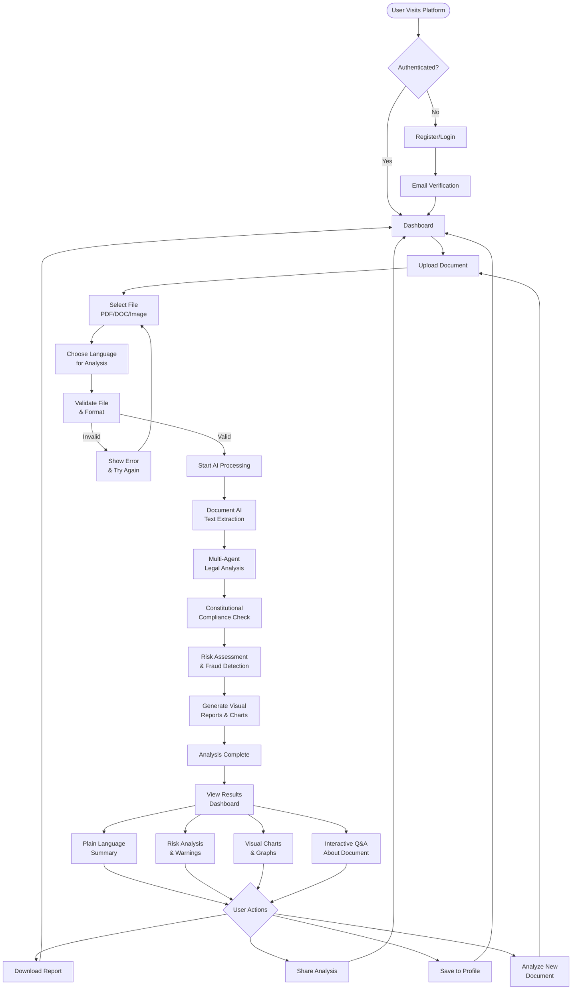
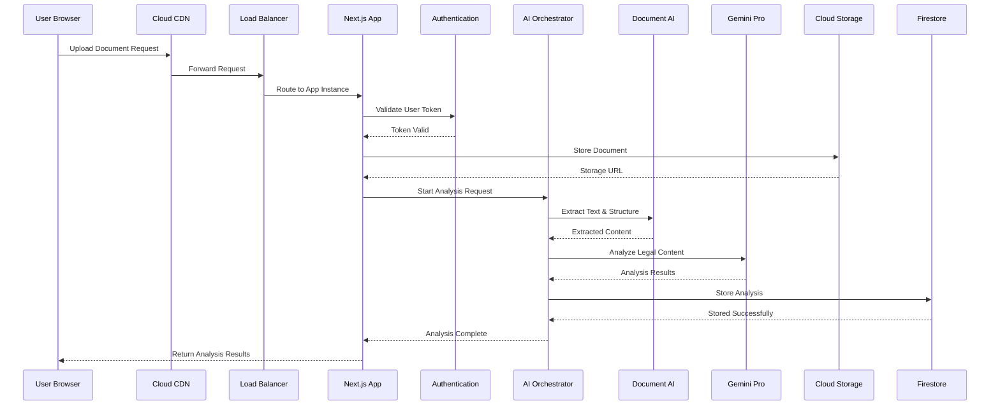

# LexBharat
**"Constitutional law, AI clarity."**

## Overview

LexBharat is a comprehensive AI-powered platform that transforms complex legal documents into clear, actionable insights specifically designed for the Indian legal ecosystem. Built entirely on Google Cloud infrastructure, it employs a sophisticated multi-agent AI system to analyze legal documents, assess risks, and provide constitutional compliance guidance in multiple Indian languages.

## Problem Statement

Legal documents in India are filled with complex jargon, creating information asymmetry that exposes citizens to financial and legal risks. Our platform bridges this gap by making legal information accessible to everyone.

## Solution

A multi-agent AI system that provides plain-language summaries, risk assessments, constitutional compliance checks, and fraud detection - all grounded in Indian law and available in multiple languages.

## Architecture Overview



## Multi-Agent System Architecture



## User Journey Flow



## Request Flow Architecture



## Technology Stack

### AI & Machine Learning
- **Vertex AI**: Model hosting & training
- **Gemini Pro**: Primary LLM for legal analysis
- **Document AI**: OCR & document structure extraction
- **Natural Language AI**: Text analysis and understanding
- **Translation API**: Multilingual support

### Frontend & Backend
- **Next.js 14**: Full-stack React framework
- **TypeScript**: Type safety and development experience
- **Tailwind CSS**: Utility-first CSS framework
- **React Query**: State management and caching

### Cloud Infrastructure
- **Cloud Run**: Serverless deployment platform
- **Cloud Storage**: Document and file storage
- **Firestore**: NoSQL database for metadata
- **Cloud CDN**: Content delivery network
- **Cloud Load Balancing**: Traffic distribution

### DevOps & Monitoring
- **Cloud Build**: CI/CD pipeline
- **Cloud Monitoring**: Application monitoring
- **Cloud Logging**: Centralized logging
- **Cloud Security Command Center**: Security management
- **Identity & Access Management**: Authentication & authorization

## Key Features

- **Multi-Format Document Processing**: PDF, DOC, Images, Scanned documents with OCR
- **Constitutional Compliance Analysis**: Real-time checking against Indian constitutional provisions
- **Risk Assessment Engine**: AI-powered risk scoring with severity indicators
- **Fraud Pattern Detection**: Historical scam recognition and prevention alerts
- **Plain Language Summaries**: Complex legal terms explained in simple language
- **Interactive Q&A System**: Ask specific questions about document clauses
- **Multilingual Support**: Major Indian languages with cultural context
- **Legal Precedent Matching**: Similar case identification and outcome analysis
- **Real-time Legal Updates**: Notifications about relevant legal developments
- **Visual Analytics**: Charts, graphs, and risk visualization dashboards
- **Collaborative Annotations**: Expert insights and community-driven knowledge
- **Document Comparison Tools**: Side-by-side analysis of multiple documents

## Getting Started

### Prerequisites

- Node.js 18+ and npm/yarn/pnpm
- Google Cloud Platform account
- Firebase project setup

### Installation

1. Clone the repository:
```bash
git clone https://github.com/Tez2213/LexBharat.git
cd LexBharat
```

2. Install dependencies:
```bash
npm install
# or
yarn install
# or
pnpm install
```

3. Set up environment variables:
```bash
cp .env.example .env.local
```

4. Configure Google Cloud credentials and Firebase:
```bash
# Add your GCP service account key
# Configure Firebase project settings
# Set up Vertex AI and Document AI APIs
```

5. Run the development server:
```bash
npm run dev
# or
yarn dev
# or
pnpm dev
```

6. Open [http://localhost:3000](http://localhost:3000) in your browser.

## Environment Variables

```env
# Google Cloud Configuration
GOOGLE_CLOUD_PROJECT_ID=your-project-id
GOOGLE_CLOUD_REGION=asia-south1
GOOGLE_APPLICATION_CREDENTIALS=path/to/service-account.json

# Firebase Configuration
NEXT_PUBLIC_FIREBASE_API_KEY=your-api-key
NEXT_PUBLIC_FIREBASE_AUTH_DOMAIN=your-auth-domain
NEXT_PUBLIC_FIREBASE_PROJECT_ID=your-project-id

# Vertex AI Configuration
VERTEX_AI_LOCATION=asia-south1
GEMINI_PRO_MODEL=gemini-pro

# Document AI Configuration
DOCUMENT_AI_PROCESSOR_ID=your-processor-id
DOCUMENT_AI_LOCATION=us

# Translation API
TRANSLATION_API_KEY=your-translation-key
```

## Project Structure

```
lexbharat/
├── src/
│   ├── app/                    # Next.js app directory
│   │   ├── (auth)/            # Authentication pages
│   │   ├── dashboard/         # Dashboard pages
│   │   ├── analysis/          # Analysis results pages
│   │   └── api/               # API routes
│   ├── components/            # Reusable React components
│   │   ├── ui/                # UI components
│   │   ├── forms/             # Form components
│   │   └── charts/            # Chart components
│   ├── lib/                   # Utility libraries
│   │   ├── ai/                # AI service integrations
│   │   ├── auth/              # Authentication utilities
│   │   └── utils/             # General utilities
│   ├── stores/                # State management
│   └── types/                 # TypeScript type definitions
├── public/                    # Static assets
├── docs/                      # Documentation
└── scripts/                   # Build and deployment scripts
```

## AI Agent System

### Constitutional Agent
Pre-trained on Indian Constitution, IPC, CrPC, and legal precedents. Provides constitutional compliance analysis and identifies potential rights violations.

### Document Analyzer
Processes uploaded documents, extracts semantic meaning, and structures content for analysis. Handles multiple formats including scanned documents.

### Web Intelligence Agent
Performs real-time legal research, monitors current developments, and finds relevant precedents and case law.

### Visualization Agent
Transforms complex analysis into intuitive charts, graphs, and visual reports that are easy to understand.

## Development Workflow

### Local Development
1. Start the development server
2. Make changes to components or pages
3. Test functionality locally
4. Run type checking and linting

### Testing
```bash
# Run unit tests
npm run test

# Run integration tests
npm run test:integration

# Run E2E tests
npm run test:e2e
```

### Deployment
```bash
# Build for production
npm run build

# Deploy to Google Cloud Run
npm run deploy

# Deploy with CI/CD
git push origin main  # Triggers Cloud Build
```

## API Documentation

### Authentication Endpoints
- `POST /api/auth/login` - User login
- `POST /api/auth/register` - User registration
- `POST /api/auth/logout` - User logout

### Document Processing Endpoints
- `POST /api/documents/upload` - Upload document for analysis
- `GET /api/documents/:id` - Get document details
- `POST /api/documents/:id/analyze` - Start AI analysis
- `GET /api/analysis/:id` - Get analysis results

### User Management Endpoints
- `GET /api/user/profile` - Get user profile
- `PUT /api/user/profile` - Update user profile
- `GET /api/user/documents` - Get user's documents

## Contributing

1. Fork the repository
2. Create a feature branch: `git checkout -b feature/new-feature`
3. Make your changes and commit: `git commit -m 'Add new feature'`
4. Push to the branch: `git push origin feature/new-feature`
5. Submit a pull request

## Cost Optimization

### Strategies Implemented
- **Freemium Model**: Basic analysis free, advanced features paid
- **Intelligent Caching**: Reduce API calls through smart caching
- **Serverless Architecture**: Pay-per-use model reduces fixed costs
- **Gradual Scaling**: Start with core features, expand based on demand

### Estimated 6-Month Costs (INR)
- Vertex AI (Gemini Pro): ₹9,00,000
- Document AI: ₹4,80,000
- Cloud Run: ₹1,80,000
- Cloud Storage: ₹1,20,000
- Firestore: ₹1,50,000
- Translation API: ₹2,40,000
- Other Services: ₹2,10,000
- **Total**: ₹22,80,000

## Security & Compliance

- **Data Encryption**: All data encrypted in transit and at rest
- **Indian Data Sovereignty**: Compliant with Indian data protection laws
- **Access Control**: Role-based access control with IAM
- **Audit Logging**: Comprehensive audit trails for all operations
- **Security Monitoring**: Real-time security monitoring and alerts

## Support & Documentation

- **User Guide**: [docs/user-guide.md](docs/user-guide.md)
- **Developer Guide**: [docs/developer-guide.md](docs/developer-guide.md)
- **API Reference**: [docs/api-reference.md](docs/api-reference.md)
- **Troubleshooting**: [docs/troubleshooting.md](docs/troubleshooting.md)

## License

This project is licensed under the MIT License - see the [LICENSE](LICENSE) file for details.

## Acknowledgments

- Built for the Gen AI Exchange Hackathon 2025
- Powered by Google Cloud Platform
- Designed for the Indian legal ecosystem

---

**LexBharat** - Empowering every Indian with AI-powered legal intelligence
