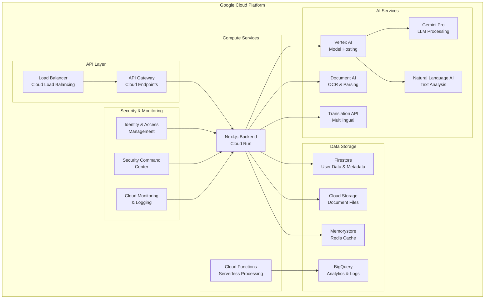
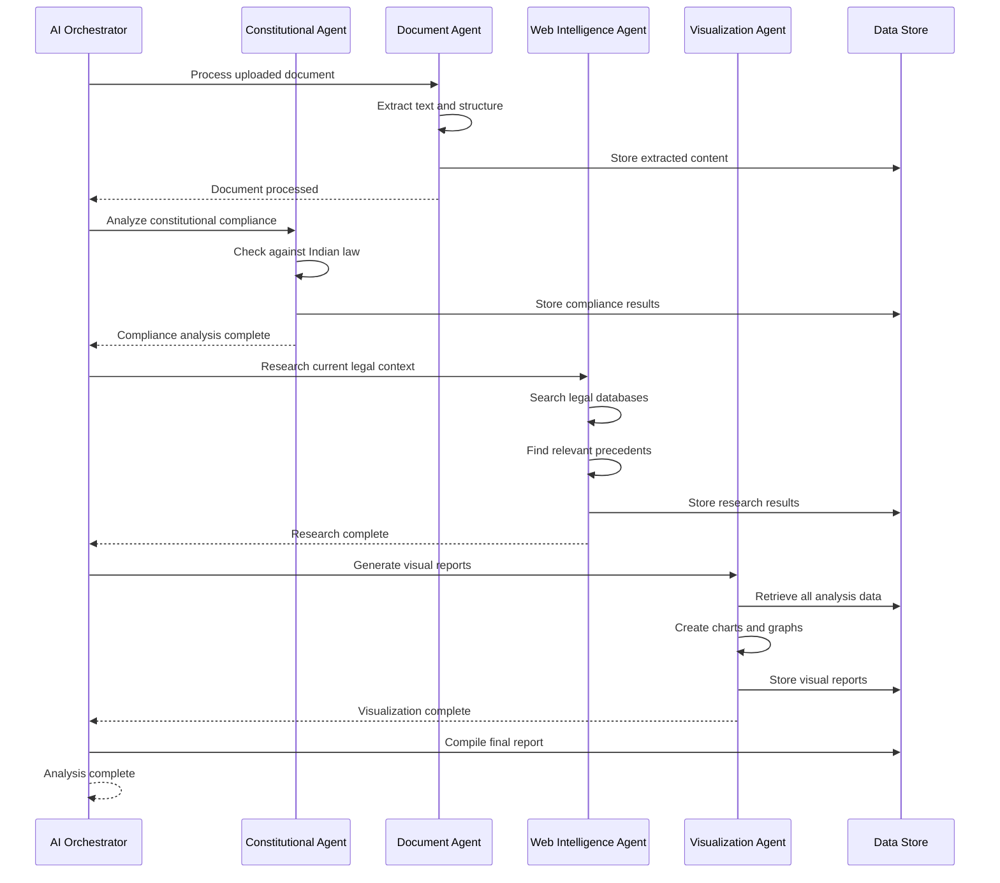
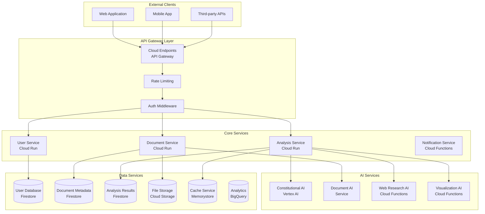

# LexBharat Backend
**"Constitutional law, AI clarity."**

## Backend Architecture Overview

LexBharat's backend is a robust, scalable system built on Google Cloud Platform, implementing a sophisticated multi-agent AI architecture for legal document analysis. The backend handles document processing, AI orchestration, constitutional compliance checking, and real-time legal intelligence.

## System Architecture



## Multi-Agent AI Architecture



## Microservices Architecture



## Core Components

### 1. AI Orchestrator
The central coordinator that manages the multi-agent workflow:

- **Document Processing Pipeline**: Manages the flow from document upload to final analysis
- **Agent Coordination**: Orchestrates communication between specialized AI agents
- **Resource Management**: Optimizes resource allocation across AI services
- **Error Handling**: Implements comprehensive error recovery and retry mechanisms

### 2. Constitutional Agent
Specialized AI agent for Indian legal compliance:

- **Indian Constitution Knowledge**: Pre-trained on Articles, Amendments, and interpretations
- **Legal Code Integration**: IPC, CrPC, CPC, and other statutory provisions
- **Precedent Analysis**: Supreme Court and High Court judgments
- **Rights Mapping**: Connects document clauses to fundamental rights

### 3. Document Analyzer Agent
Handles document processing and content extraction:

- **Multi-format Support**: PDF, DOC, DOCX, images, scanned documents
- **OCR Processing**: Powered by Google Document AI
- **Semantic Analysis**: Extracts meaning and context from legal text
- **Structure Recognition**: Identifies clauses, sections, and legal constructs

### 4. Web Intelligence Agent
Provides real-time legal research capabilities:

- **Legal Database Search**: Searches current legal developments
- **Precedent Matching**: Finds similar cases and outcomes
- **Regulatory Updates**: Monitors changes in laws and regulations
- **Risk Assessment**: Analyzes current legal landscape for risks

### 5. Visualization Agent
Creates intuitive visual representations:

- **Risk Matrices**: Visual risk scoring and categorization
- **Compliance Charts**: Constitutional compliance visualization
- **Trend Analysis**: Legal trend and pattern visualization
- **Interactive Dashboards**: User-friendly analytical interfaces

## API Architecture

### Authentication & Authorization
```
POST /api/auth/login          - User authentication
POST /api/auth/register       - User registration
POST /api/auth/refresh        - Token refresh
POST /api/auth/logout         - User logout
GET  /api/auth/verify         - Email verification
```

### Document Management
```
POST /api/documents/upload    - Upload document for analysis
GET  /api/documents/:id       - Retrieve document details
PUT  /api/documents/:id       - Update document metadata
DELETE /api/documents/:id     - Delete document
GET  /api/documents/          - List user documents
```

### Analysis Services
```
POST /api/analysis/start      - Initiate document analysis
GET  /api/analysis/:id        - Get analysis results
GET  /api/analysis/:id/status - Check analysis status
POST /api/analysis/:id/qa     - Ask questions about document
GET  /api/analysis/:id/risks  - Get risk assessment
GET  /api/analysis/:id/visual - Get visualization data
```

### Constitutional Services
```
POST /api/constitutional/check    - Check constitutional compliance
GET  /api/constitutional/rights   - Get related rights information
GET  /api/constitutional/articles - Search constitutional articles
POST /api/constitutional/compare  - Compare with constitutional provisions
```

### User Management
```
GET  /api/user/profile        - Get user profile
PUT  /api/user/profile        - Update user profile
GET  /api/user/documents      - Get user's document history
GET  /api/user/analytics      - Get user analytics
POST /api/user/preferences    - Update user preferences
```

## Technology Stack

### Core Technologies
- **Runtime**: Node.js 18+
- **Framework**: Next.js 14 (API Routes)
- **Language**: TypeScript
- **Database**: Firestore (NoSQL)
- **Cache**: Redis (Memorystore)
- **Storage**: Google Cloud Storage

### Google Cloud AI Services
- **Vertex AI**: Model hosting and inference
- **Gemini Pro**: Large language model for legal analysis
- **Document AI**: OCR and document processing
- **Natural Language AI**: Text analysis and understanding
- **Translation API**: Multi-language support
- **AutoML**: Custom model training

### Infrastructure
- **Compute**: Cloud Run (serverless containers)
- **Functions**: Cloud Functions (event-driven)
- **API Gateway**: Cloud Endpoints
- **Load Balancing**: Google Cloud Load Balancer
- **CDN**: Cloud CDN
- **Monitoring**: Cloud Monitoring & Logging

### Security & Compliance
- **Authentication**: Firebase Auth
- **Authorization**: IAM (Identity & Access Management)
- **Encryption**: Cloud KMS
- **Security**: Security Command Center
- **Compliance**: Data sovereignty for Indian data

## Environment Configuration

### Required Environment Variables
```env
# Google Cloud Configuration
GOOGLE_CLOUD_PROJECT_ID=lexbharat-production
GOOGLE_CLOUD_REGION=asia-south1
GOOGLE_APPLICATION_CREDENTIALS=/path/to/service-account.json

# Vertex AI Configuration
VERTEX_AI_LOCATION=asia-south1
GEMINI_PRO_MODEL=gemini-pro
VERTEX_AI_ENDPOINT=https://asia-south1-aiplatform.googleapis.com

# Document AI Configuration
DOCUMENT_AI_PROCESSOR_ID=your-processor-id
DOCUMENT_AI_LOCATION=us
DOCUMENT_AI_PROJECT_ID=lexbharat-production

# Firestore Configuration
FIRESTORE_PROJECT_ID=lexbharat-production
FIRESTORE_DATABASE_ID=(default)

# Cloud Storage Configuration
CLOUD_STORAGE_BUCKET=lexbharat-documents
CLOUD_STORAGE_REGION=asia-south1

# Redis Configuration
REDIS_HOST=your-memorystore-ip
REDIS_PORT=6379
REDIS_PASSWORD=your-redis-password

# Translation API
TRANSLATION_API_KEY=your-translation-key

# Security Configuration
JWT_SECRET=your-jwt-secret
ENCRYPTION_KEY=your-encryption-key
API_RATE_LIMIT=1000

# Monitoring
CLOUD_MONITORING_ENABLED=true
CLOUD_LOGGING_ENABLED=true
```

## Local Development Setup

### Prerequisites
```bash
# Install Node.js 18+
# Install Google Cloud SDK
# Install Docker (optional)
```

### Installation Steps
```bash
# Clone the repository
git clone https://github.com/Tez2213/LexBharat.git
cd LexBharat/backend

# Install dependencies
npm install

# Set up environment variables
cp .env.example .env.local
# Edit .env.local with your configuration

# Set up Google Cloud authentication
gcloud auth application-default login
gcloud config set project lexbharat-production

# Initialize Firestore
npm run setup:firestore

# Start development server
npm run dev
```

### Development Commands
```bash
# Start development server
npm run dev

# Run tests
npm run test
npm run test:integration
npm run test:e2e

# Type checking
npm run type-check

# Linting
npm run lint
npm run lint:fix

# Build for production
npm run build

# Start production server
npm run start
```

## Data Models

### User Model
```typescript
interface User {
  id: string;
  email: string;
  name: string;
  phoneNumber?: string;
  preferredLanguage: string;
  subscription: 'free' | 'premium' | 'enterprise';
  createdAt: Date;
  updatedAt: Date;
  profile: {
    profession?: string;
    location?: string;
    interests: string[];
  };
}
```

### Document Model
```typescript
interface Document {
  id: string;
  userId: string;
  title: string;
  originalName: string;
  fileType: string;
  size: number;
  storageUrl: string;
  uploadedAt: Date;
  status: 'uploaded' | 'processing' | 'analyzed' | 'error';
  metadata: {
    pageCount?: number;
    language?: string;
    extractedText?: string;
  };
}
```

### Analysis Model
```typescript
interface Analysis {
  id: string;
  documentId: string;
  userId: string;
  status: 'pending' | 'processing' | 'completed' | 'failed';
  results: {
    summary: string;
    riskScore: number;
    constitutionalCompliance: ComplianceResult[];
    fraudDetection: FraudResult[];
    recommendations: string[];
    visualization: VisualizationData;
  };
  createdAt: Date;
  completedAt?: Date;
  processingTime?: number;
}
```

## AI Service Integration

### Vertex AI Setup
```typescript
import { VertexAI } from '@google-cloud/vertexai';

const vertex = new VertexAI({
  project: process.env.GOOGLE_CLOUD_PROJECT_ID,
  location: process.env.VERTEX_AI_LOCATION,
});

const model = vertex.preview.getGenerativeModel({
  model: 'gemini-pro',
  generationConfig: {
    maxOutputTokens: 8192,
    temperature: 0.1,
    topP: 0.95,
  },
});
```

### Document AI Integration
```typescript
import { DocumentProcessorServiceClient } from '@google-cloud/documentai';

const client = new DocumentProcessorServiceClient();
const processorName = `projects/${projectId}/locations/${location}/processors/${processorId}`;

async function processDocument(documentBuffer: Buffer) {
  const request = {
    name: processorName,
    rawDocument: {
      content: documentBuffer,
      mimeType: 'application/pdf',
    },
  };
  
  const [result] = await client.processDocument(request);
  return result.document;
}
```

## Security Implementation

### Authentication Middleware
```typescript
import { verifyIdToken } from 'firebase-admin/auth';

export async function authenticateUser(req: Request) {
  const token = req.headers.authorization?.replace('Bearer ', '');
  if (!token) throw new Error('No token provided');
  
  const decodedToken = await verifyIdToken(token);
  return decodedToken;
}
```

### Rate Limiting
```typescript
import rateLimit from 'express-rate-limit';

const createRateLimit = (windowMs: number, max: number) =>
  rateLimit({
    windowMs,
    max,
    message: 'Too many requests from this IP',
    standardHeaders: true,
    legacyHeaders: false,
  });

export const generalLimiter = createRateLimit(15 * 60 * 1000, 100); // 100 requests per 15 minutes
export const analysisLimiter = createRateLimit(60 * 60 * 1000, 10);  // 10 analysis per hour
```

## Performance Optimization

### Caching Strategy
```typescript
import Redis from 'ioredis';

const redis = new Redis({
  host: process.env.REDIS_HOST,
  port: parseInt(process.env.REDIS_PORT),
  password: process.env.REDIS_PASSWORD,
});

export async function getCachedAnalysis(documentId: string) {
  const cached = await redis.get(`analysis:${documentId}`);
  return cached ? JSON.parse(cached) : null;
}

export async function setCachedAnalysis(documentId: string, analysis: any) {
  await redis.setex(`analysis:${documentId}`, 3600, JSON.stringify(analysis));
}
```

### Database Optimization
```typescript
// Firestore indexing for common queries
const indexes = [
  { collection: 'documents', fields: ['userId', 'uploadedAt'] },
  { collection: 'analysis', fields: ['userId', 'createdAt'] },
  { collection: 'analysis', fields: ['documentId', 'status'] },
];
```

## Monitoring & Logging

### Cloud Monitoring Setup
```typescript
import { Monitoring } from '@google-cloud/monitoring';

const monitoring = new Monitoring.MetricServiceClient();

export async function recordCustomMetric(metricType: string, value: number) {
  const projectPath = monitoring.projectPath(projectId);
  
  const dataPoint = {
    interval: {
      endTime: { seconds: Date.now() / 1000 },
    },
    value: { doubleValue: value },
  };
  
  const timeSeries = {
    metric: { type: metricType },
    resource: { type: 'cloud_run_revision' },
    points: [dataPoint],
  };
  
  await monitoring.createTimeSeries({
    name: projectPath,
    timeSeries: [timeSeries],
  });
}
```

### Structured Logging
```typescript
import { Logging } from '@google-cloud/logging';

const logging = new Logging();
const log = logging.log('lexbharat-backend');

export function logAnalysisStart(documentId: string, userId: string) {
  const metadata = {
    resource: { type: 'cloud_run_revision' },
    severity: 'INFO',
  };
  
  const entry = log.entry(metadata, {
    message: 'Analysis started',
    documentId,
    userId,
    timestamp: new Date().toISOString(),
  });
  
  log.write(entry);
}
```

## Deployment

### Cloud Run Deployment
```yaml
# cloudbuild.yaml
steps:
  - name: 'gcr.io/cloud-builders/docker'
    args: ['build', '-t', 'gcr.io/$PROJECT_ID/lexbharat-backend', '.']
  - name: 'gcr.io/cloud-builders/docker'
    args: ['push', 'gcr.io/$PROJECT_ID/lexbharat-backend']
  - name: 'gcr.io/cloud-builders/gcloud'
    args:
      - 'run'
      - 'deploy'
      - 'lexbharat-backend'
      - '--image'
      - 'gcr.io/$PROJECT_ID/lexbharat-backend'
      - '--region'
      - 'asia-south1'
      - '--platform'
      - 'managed'
```

### Dockerfile
```dockerfile
FROM node:18-alpine

WORKDIR /app

COPY package*.json ./
RUN npm ci --only=production

COPY . .
RUN npm run build

EXPOSE 8080

CMD ["npm", "start"]
```

## Error Handling

### Global Error Handler
```typescript
export function globalErrorHandler(error: Error, req: Request, res: Response, next: NextFunction) {
  const errorId = generateErrorId();
  
  // Log error with context
  console.error({
    errorId,
    message: error.message,
    stack: error.stack,
    url: req.url,
    method: req.method,
    userId: req.user?.uid,
  });
  
  // Send appropriate response
  if (error instanceof ValidationError) {
    res.status(400).json({ error: 'Validation failed', errorId });
  } else if (error instanceof AuthError) {
    res.status(401).json({ error: 'Authentication failed', errorId });
  } else {
    res.status(500).json({ error: 'Internal server error', errorId });
  }
}
```

## Testing

### Unit Tests
```typescript
import { processDocument } from '../services/documentService';

describe('Document Service', () => {
  test('should process PDF document successfully', async () => {
    const mockBuffer = Buffer.from('test pdf content');
    const result = await processDocument(mockBuffer, 'application/pdf');
    
    expect(result).toBeDefined();
    expect(result.extractedText).toContain('test');
  });
});
```

### Integration Tests
```typescript
import request from 'supertest';
import { app } from '../app';

describe('Analysis API', () => {
  test('POST /api/analysis/start should initiate analysis', async () => {
    const response = await request(app)
      .post('/api/analysis/start')
      .send({ documentId: 'test-doc-id' })
      .expect(200);
    
    expect(response.body.analysisId).toBeDefined();
  });
});
```

## Contributing

### Code Standards
- Follow TypeScript strict mode
- Use ESLint and Prettier configurations
- Write comprehensive tests for all features
- Document all public APIs
- Follow conventional commits

### Pull Request Process
1. Create feature branch from main
2. Implement changes with tests
3. Update documentation
4. Submit PR with detailed description
5. Address review comments
6. Merge after approval

---

**LexBharat Backend** - Powering AI-driven legal document intelligence for India